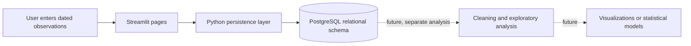

<div align="center">

# PainMetrics — Symptoms & Health Log

### A structured, longitudinal health-tracking application built with Streamlit and PostgreSQL

[](https://www.python.org/)
[](https://streamlit.io/)
[](https://www.postgresql.org/)
[](LICENSE)

**PainMetrics** is a multi-page application for collecting organized, date-based records of symptoms, pain, daily routines, and activity. It is designed to turn repeated self-reported observations into a consistent relational dataset that can be explored with data-analysis tools.

[Overview](#project-overview) · [Features](#features) · [Data model](#data-model) · [Setup](#getting-started) · [Data science relevance](#data-science-and-analysis) · [Limitations](#privacy-safety-and-limitations)

</div>

---

## Project overview

Pain and symptom experiences are difficult to summarize from memory alone. PainMetrics provides a repeatable way to record observations over time, including pain intensity at different times of day, associated activities, sleep, stiffness, and other daily factors.

The project currently focuses on **data capture and persistence**. It stores records in PostgreSQL using patient/date keys and a relational schema. It does **not** currently provide statistical reports, trend charts, predictive models, or medical recommendations; the collected structured data can support those analyses in a separate, explicitly designed next step.

### Project goals

- Make daily symptom and activity logging straightforward.
- Capture repeated observations in a consistent, structured format.
- Relate daily summaries, pain characteristics, and activities to a profile and date.
- Provide a practical foundation for exploratory analysis of longitudinal data.
- Demonstrate an end-to-end workflow across a Python UI, a relational database, and data-oriented problem framing.

## Features

### Daily summary

Record sleep duration and quality; morning, afternoon, evening, and nighttime pain ratings; stiffness timing, duration, and intensity; pain regions; walking, sitting, and standing time; lumbar support; exercise and workout duration; medication information; fatigue; hydration; and a free-text daily note.

### Activity log

Record one or more activities for a selected date, including time of day, activity type, duration and/or repetitions, and pain before, during, 30 minutes after, and two hours after the activity.

### Pain characteristics

Record primary and secondary pain locations and intensities, pain type, whether pain radiates, and whether it is pinpoint/diffuse or deep/surface.

### Additional capabilities

- Streamlit multi-page navigation with a shared patient/profile ID.
- Current-date or past-date entry selection.
- PostgreSQL persistence with parameterized database queries.
- Database constraints, foreign keys, and reference tables for pain scores and pain types.
- Repeat submissions update daily summary and pain-characteristic records for the same profile and date. Submitting the activity form replaces entries previously submitted through the app for that profile and date.
- A fresh-install script creates the database, schema, tables, and reference data.

## Data science and analysis

This project is relevant to data analysis and data science because it addresses an upstream challenge common in real analysis projects: collecting repeatable observations and modeling them so records can be joined, validated, and analyzed later.

### Analytical opportunities supported by the data

With an appropriately consented, sufficiently sized, and de-identified dataset, analysts could investigate questions such as:

- How do self-reported pain levels vary by time of day or across dates?
- Are sleep quality, stiffness, fatigue, or activity duration associated with reported pain?
- How do pain ratings change before and after different activities?
- Which symptom dimensions have missing or inconsistent observations?
- How do within-person patterns differ from population-level patterns?

These are **potential analyses, not current app outputs**. The repository does not currently calculate correlations, estimate causal effects, train machine-learning models, or display analytics dashboards. Any future analysis should account for repeated measures, missingness, self-report bias, confounding, and privacy; associations must not be presented as causal or diagnostic conclusions.

### Data workflow



## Technology stack

| Area | Technology | Role |
|---|---|---|
| Language | Python | Application logic and database setup |
| User interface | Streamlit | Interactive multi-page data-entry application |
| UI component | `streamlit-extras` | Selectable cards on the home page |
| Database | PostgreSQL | Relational storage, constraints, keys, and reference data |
| Database driver | Psycopg 3 | PostgreSQL connections and parameterized SQL |
| Configuration | `python-dotenv` | Loads local database connection settings from `.env` |
| Dependency management | `requirements.txt` | Python package installation |

The requirements file also pins NumPy, pandas, Altair, Vega datasets, and yfinance. These packages are not currently used by the application source for analytics or visualizations.

### Portfolio and engineering concepts

The implemented workflow provides examples of:

- Designing a relational schema for repeated, date-indexed observations.
- Using primary keys, foreign keys, uniqueness rules, and range checks to represent data relationships and enforce basic integrity.
- Separating UI, persistence, and database initialization responsibilities across modules.
- Using parameterized SQL and PostgreSQL upserts for safe, repeatable writes.
- Loading local connection configuration from an environment file rather than embedding credentials in application code.

## Data model

The database is initialized by [`db_init.py`](db_init.py). Its core tables are:

| Table | Purpose |
|---|---|
| `patients` | Profile identifier and optional care-team label |
| `daily_summary_logs` | One daily summary per profile and date |
| `daily_summary_pain_regions` | Pain regions associated with a daily summary |
| `daily_summary_exercises` | Exercise types associated with a daily summary |
| `activity_logs` | Activities and pain ratings around each activity |
| `pain_characteristics` | Daily pain locations, intensity, radiation, and descriptors |
| `pain_characteristic_types` | Links pain records to pain-type reference values |
| `pain_intensity_scale` | Reference scores from 0 to 10 |
| `pain_types` | Reference codes for pain types |

Primary and foreign keys link related records, while unique constraints support the application's profile/date update behavior. The persistence functions are in [`database.py`](database.py); database initialization and data entry are separate responsibilities.

## Getting started

### Requirements

- Python 3.11 or later
- PostgreSQL running locally or reachable from your machine
- A PostgreSQL role with permission to create a database (needed for the initial setup script)

### 1. Get the project

```bash
git clone https://github.com/harshchandrawork/painmetrics-healthlog-stream.git
cd painmetrics-healthlog-stream
```

### 2. Create and activate a virtual environment

```bash
python -m venv .venv
```

macOS/Linux:

```bash
source .venv/bin/activate
```

Windows PowerShell:

```powershell
.venv\Scripts\Activate.ps1
```

### 3. Install dependencies

```bash
python -m pip install --upgrade pip
python -m pip install -r requirements.txt
```

### 4. Configure PostgreSQL

Create a `.env` file in the project root. Set `CONN_INFO` to a PostgreSQL connection string for a role that can connect to the maintenance database and create `symptoms_tracker_db`:

```dotenv
CONN_INFO="host=localhost port=5432 user=YOUR_POSTGRES_USER password=YOUR_POSTGRES_PASSWORD"
```

Replace the placeholders with your local PostgreSQL role and password. Keep `.env` private; it is excluded by `.gitignore`. If your database provider requires TLS or additional connection options, include the appropriate libpq connection parameters in `CONN_INFO`.

### 5. Initialize the database

From the project root, run:

```bash
python db_init.py
```

The setup script connects to PostgreSQL, creates the `symptoms_tracker_db` database if needed, creates the application tables, and seeds the pain-score and pain-type lookup tables. It does not import anyone's historical patient records.

### 6. Run the application

```bash
streamlit run streamlit_app.py
```

Open the local URL printed by Streamlit. Enter a consistent profile ID on the home page, choose a logging page, select a date, and submit an entry.

## Repository structure

```text
.
├── streamlit_app.py          # Streamlit entry point and home/navigation
├── pages/
│   ├── daily_summary.py      # Daily symptom and routine entry
│   ├── activities_log.py     # Activity and before/after pain entry
│   └── pain_intensity.py     # Pain location and characteristic entry
├── database.py               # PostgreSQL persistence functions
├── db_init.py                # Fresh database/schema/reference-data setup
├── requirements.txt          # Python dependencies
├── .streamlit/config.toml    # Streamlit theme and UI settings
└── LICENSE                   # MIT License
```

## Configuration and data handling

- Database connection settings are read from `CONN_INFO` in the project-root `.env` file.
- The application database is named `symptoms_tracker_db`.
- Patient/profile IDs are user-entered labels used to associate records. They are **not** accounts, authentication, or access controls.
- The app stores self-reported health-related information, including pain, medication, and symptom notes. Use synthetic data while evaluating the project.
- Historical CSV import tooling and local sample data are intentionally excluded from the public repository. Fresh installation creates an empty application database with required reference rows.

## Privacy, safety, and limitations

> **Prototype notice:** PainMetrics is an educational portfolio project, not a medical device or clinical decision-support system. It does not diagnose, treat, or replace advice from a qualified healthcare professional.

- Do not enter real patient or other sensitive personal health information into a public or otherwise unreviewed deployment.
- A profile ID does not protect data. This project does not implement user authentication, authorization, tenant isolation, consent management, audit logging, or a production privacy/compliance program.
- Anyone deploying a modified copy is responsible for securing the application, PostgreSQL instance, credentials, backups, network access, and any data they collect, as well as assessing applicable laws and institutional policies.
- Health observations are self-reported and may be incomplete, inaccurate, or affected by selection bias. They should not be treated as clinical evidence without appropriate review.
- Database persistence and entry forms are implemented; analytics charts, export/report workflows, automated data-quality reporting, and predictive modeling are not currently part of the app.

## Development notes

Run the setup script from the repository root so the root `.env` file is discovered. The setup requires PostgreSQL to be available and the configured role to have database-creation privileges.

There is currently no committed automated test suite or CI workflow. Before relying on changes, validate Python syntax and test database initialization and each entry flow against a disposable PostgreSQL database with synthetic data.

## Roadmap

Possible next steps for the project include:

- Add a reproducible synthetic dataset and sample analysis notebook.
- Build exploratory trend charts with clearly documented aggregation and filtering choices.
- Add data-quality checks and a documented export path for analysis.
- Add automated tests for form-to-database behavior and schema initialization.
- Explore privacy-conscious authentication and deployment architecture before any real-world data collection.

## Contributing

Suggestions, issues, and pull requests are welcome. Please do not include credentials, database dumps, real patient data, or identifying information in issues, commits, screenshots, or example datasets. Use synthetic data for bug reports and tests.

## License

This project is available under the [MIT License](LICENSE).
